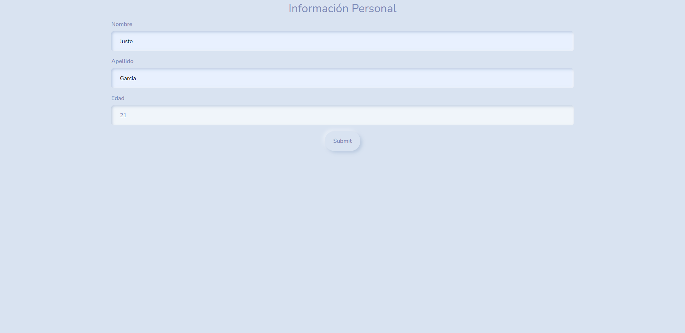
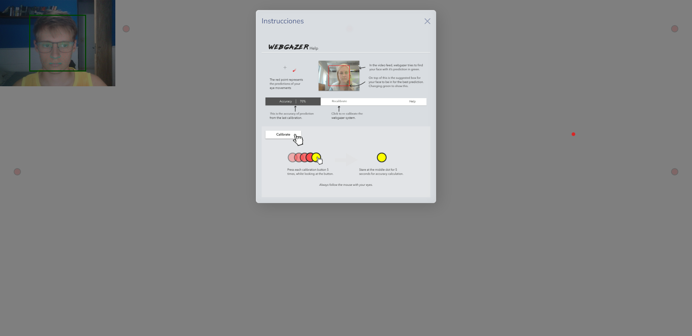
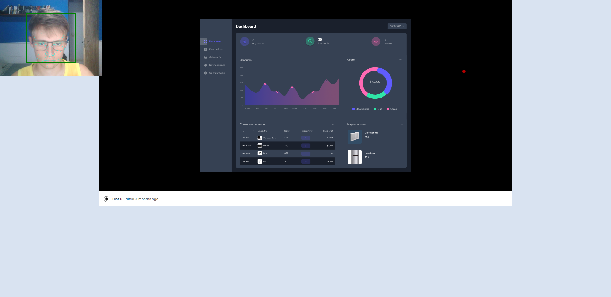

# User Gaze Tracking Tool for Prototypes

A web application that uses WebGazer.js to record participants’ gaze while presenting a prototype or image and assigning tasks. It is intended for remote user studies: it simplifies the collection, storage, and export of gaze and mouse data without requiring participants to be physically present.

This tool is designed to streamline remote user studies, reduce logistical overhead, and enable reproducible collection of users' behavior data.

1. **Home Page (/):** Contains a data entry form. Users should fill the form and click "Submit" to proceed.

2. **Gaze Tracking Page:** After submitting the form, you will be redirected to a page where gaze tracking starts using WebGazer.js. The page includes a calibration phase with a series of buttons and then displays a Figma prototype to record the user's gaze behavior. The collected data is stored in a SQLite database (this can be changed later; SQLite was chosen for convenience during development).

3. **Subjects Page (/sujetos):** View the subjects stored in the database. You can access each subject's details and gaze tracking data.

4. **Results Page for a subject (/resultados?id={sujeto}):** View the gaze heatmap for a subject and download their data as CSV.

## Installation and Usage

### 1. Clone this repository

```bash
git clone https://github.com/justogm/user-gaze-track.git
cd user-gaze-track
```

### 2. Run the tool

```bash
python run.py
```

This will start to install dependencies and prompting to modify or not the existing configuration and tasks. Then it will start running the flask application.

## Configuration

You can change the configuration by GUI in any moment by running ():

```bash
# remember activating the venv or conda environment
python src/config.py
```

When a URL or image path is modified, the system checks for its existence in the database. If not found, the application will either prompt for a study name or automatically apply the associated name during the next run.

## Important

> [!CAUTION]
> This tool is under development and intended for controlled environments. It currently has serious security vulnerabilities and is not recommended for production use.

## Tech Stack

- [Flask](https://flask.palletsprojects.com/en/3.0.x/)
- [WebGazer.js](https://webgazer.cs.brown.edu/)
- [heatmap.js](https://www.patrick-wied.at/static/heatmapjs/)
- [SQLite](https://www.sqlite.org/index.html)

## Screenshots

### 1. Data Entry

Can be modified to register other variables considered relevant.



### 2. Calibration and instructions



*The calibration instructions image is provided by the module; consider creating a translated version if needed.*

### 3. Prototype presentation



## Roadmap

- [ ] Evaluate module behavior when the prototype is in fullscreen mode.
- [x] Explore alternatives for prototype presentation.
- [x] Make it easier to change the prototype instead of leaving it hardcoded.
  - A configuration file was created; see the [configuration section](#4-configure-the-tool).
- [x] Develop a parallel app for accessing and manipulating generated data.
  - The route `/sujetos` was developed
- [x] Habilitate to store data from multiples studies.
