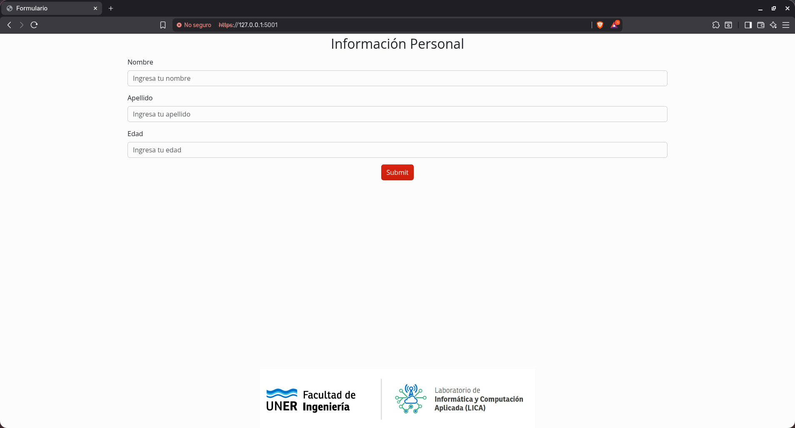
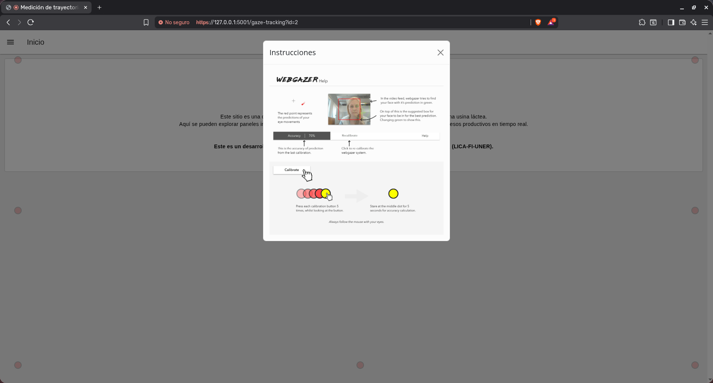
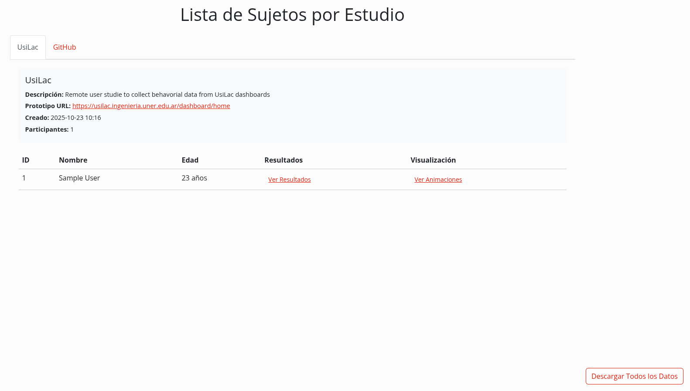

<h1 align="center">
RemoteGazeUX
</h1>

<h2 align="center">
An open-source platform for remote usability testing through eye and mouse tracking on web prototypes.
</h2>

<div align="center">


</div>

A web application that uses WebGazer.js to record participants’ gaze while presenting a prototype or image and assigning tasks. It is intended for remote user studies: it simplifies the collection, storage, and export of gaze and mouse data without requiring participants to be physically present.

Designed to streamline remote user studies, reduce logistical overhead, and enable reproducible collection of users' behavior data.

1. **Home Page (/):** Contains a data entry form. Users should fill the form and click "Submit" to proceed.

2. **Gaze Tracking Page:** After submitting the form, you will be redirected to a page where gaze tracking starts using WebGazer.js. The page includes a calibration phase with a series of buttons and then displays a Figma prototype to record the user's gaze behavior. The collected data is stored in a SQLite database (this can be changed later; SQLite was chosen for convenience during development).

3. **Subjects Page (/sujetos):** View the subjects stored in the database. You can access each subject's details and gaze tracking data.

4. **Results Page for a subject (/resultados?id={sujeto}):** View the gaze heatmap for a subject and download their data as CSV.


<div align="center">
    <h2> Installation and Usage </h2>
</div>

### 1. Clone this repository

```bash
git clone https://github.com/justogm/RemoteGazeUX.git
cd RemoteGazeUX
```

### 2. Run the tool

```bash
python run.py
```

This will start to install dependencies and prompting to modify or not the existing configuration and tasks. Then it will start running the flask application.


<div align="center">
    <h2>Configuration</h2>
</div>

You can change the configuration by GUI in any moment by running:

```bash
# remember activating the venv or conda environment
python src/config.py
```

When a URL or image path is modified, the system checks for its existence in the database. If not found, the application will either prompt for a study name or automatically apply the associated name during the next run.

<div align="center">
    <h2>Important</h2>
</div>

> [!CAUTION]
> This tool is under development and intended for controlled environments. It currently has serious security vulnerabilities and is not recommended for production use.

<div align="center">
    <h2>Tech Stack</h2>
</div>

- [Flask](https://flask.palletsprojects.com/en/3.0.x/): Backend.
- [WebGazer.js](https://webgazer.cs.brown.edu/): JS module for gaze tracking.
- [heatmap.js](https://www.patrick-wied.at/static/heatmapjs/): JS module for heatmaps plotting.
- [SQLite](https://www.sqlite.org/index.html): DB engine.

<div align="center">
    <h2>Showcase</h2>
</div>

### 1. Data Entry

Can be modified to register other variables considered relevant.



### 2. Calibration and instructions



*The calibration instructions image is provided by the module; consider creating a translated version if needed.*


<div align="center">
    <h2>Accessing your data</h2>
</div>

After conducting your remote user studies you can access the data at (`/sujetos`). It will show you different tabs for the different studies that you have registered.



There you can navigate through your studies, in each studies through your users and access their individual data and pre visualize or download some animations or heatmaps. Also you can download all the data for a given study with the button in the left bottom corner.

<div align="center">
    <h2>Contributions</h2>
</div>

Contributions welcome. Preferred workflow: fork → branch → PR.

- Keep changes small and focused.
- Add/update tests and docs for your change.
- Run tests and linters locally before opening a PR.
- Reference related issue(s) and include a short description of the change.
- For large or architectural changes, open an issue to discuss first.
- Respect the project license.

Thanks for helping improve the project!

<div align="center">
    <h2>Contact</h2>
</div>

- Justo Garcia (Main developer and maintainer): [justo.garcia@ingenieria.uner.edu.ar](mailto:justo.garcia@ingenieria.uner.edu.ar)

<div align="center">
    <h2>Contributors</h2>
</div>

<a href="https://github.com/justogm/RemoteGazeUX/graphs/contributors">
  
</a>